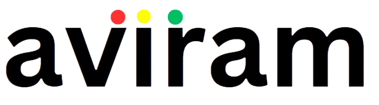

# Aviram - AI-Based Traffic Management System

**Research paper (under review at ICMLDE 2025):** (https://drive.google.com/file/d/1ebQii0DTL2jkg8b6YnQHQSG2duKveWUa/view?usp=sharing)

Aviram uses **computer vision** to read live traffic and **reinforcement learning (RL)** to adapt signal timings—especially when an **emergency vehicle route** is declared. This README is intentionally high-level for interviews.

---

## 🎥 Demos & Media

- **Object Detection & Tracking:** `openCV.mp4`  
- **Web App Walkthrough:** `App.mp4`  
- **SUMO Simulation:** `SuMO.mp4`  
- **Emergency Route Entry (screenshot):** `Website.jpg`

---

## What the System Does

- **Sees traffic:** YOLOv8 detects vehicles; **ByteTrack** assigns stable IDs and trajectories.  
- **Understands state:** From tracks we build a compact vector (per-lane counts, queue lengths, emergency flag, ETA).  
- **Decides timings:** A lightweight **multi-agent RL** controller (per intersection) chooses {extend, switch, hold}.  
- **Clears corridors:** When an emergency route is entered, downstream intersections bias timing to form a **just-in-time green wave**.

---

## Green-Wave (Emergency-Aware)

- Route and ETA are shared with intersections along the path.  
- Local agents align green windows sequentially so the vehicle meets greens in order—no blanket pre-emption of the whole network.

---

## ML Overview

**Computer Vision**  
- YOLOv8 (fine-tuned for traffic classes) + ByteTrack for multi-object tracking.  
- OpenCV preprocessing (ROI crop, normalization) for stability across conditions.

**Reinforcement Learning**  
- **State:** counts, queues, emergency flag, ETA.  
- **Actions:** extend current green (short/long), switch phase, hold.  
- **Goal:** minimize queues and delays while prioritizing emergency travel time.

---

## Reward Function

\[
\mathcal{R}_t = -\left(\alpha \sum Q_t \;+\; \beta \sum D_t \;+\; \gamma \cdot \mathbf{1}_{E_t=1} \cdot T_{\text{delay}}\right)
\]

- Queue penalty and waiting-time penalty reduce congestion.  
- Emergency delay term (higher weight) creates a corridor without freezing the city.  
- Small switch penalty can be added to avoid phase thrashing.

---

## Research Paper: Key Contributions

- **Hybrid CV+RL architecture:** Tight coupling of YOLOv8 + ByteTrack features with a lightweight, per-intersection RL controller.  
- **Route-informed control:** Shared route/ETA enables a **green-wave** corridor for emergency vehicles without hard pre-emption.  
- **Reward shaping:** Balances throughput/latency with strong emergency priority; avoids lane starvation.  
- **Realistic simulation:** OSM-derived SUMO networks with rush-hour and incident scenarios; improved emergency time and average wait vs. fixed-time baselines.  
- **Ablations & practicality:** Comparisons with literature baselines; notes on compute footprint and scaling.

---

**Contact**  
Lovish · lgarg1_be22@thapar.edu  

